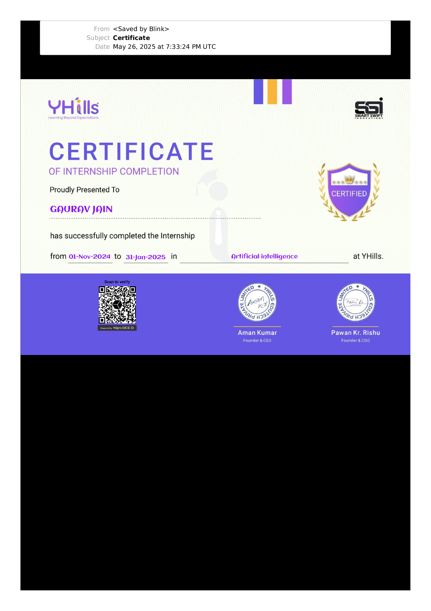
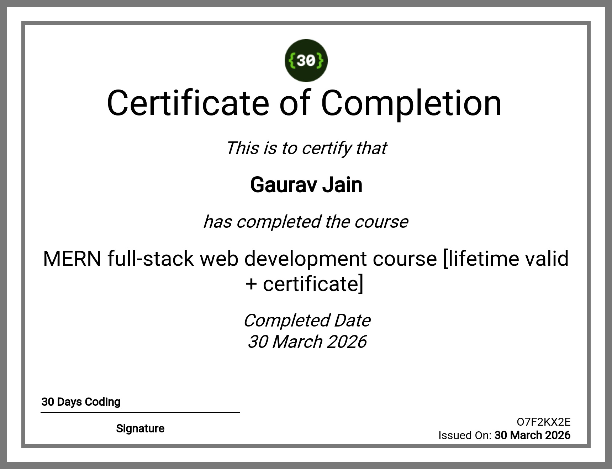

# 🏅 Certificates — Gaurav Jain

> A verified collection of my professional certifications and internship completions.  
> All certificates belong to **Gaurav Jain** and are hosted here for resume verification.

---

## 📋 Summary Table

| # | Certificate | Issuer | Type | Date | Verify |
|---|------------|--------|------|------|--------|
| 1 | Artificial Intelligence Internship | YHills Edutech (with SSI) | Internship Completion | Nov 2024 – Jan 2025 | [View ↗](#1--artificial-intelligence-internship--yhills) |
| 2 | MERN Full-Stack Web Development | 30 Days Coding | Course Completion | 30 March 2026 | [View ↗](#2--mern-full-stack-web-development--30-days-coding) |

---

## 1 · Artificial Intelligence Internship — YHills

<table>
<tr>
<td width="55%">

### 📄 Certificate Details

| Field | Info |
|-------|------|
| **Recipient** | Gaurav Jain |
| **Type** | Certificate of Internship Completion |
| **Field** | Artificial Intelligence |
| **Organization** | YHills Edutech Pvt. Ltd. |
| **Partner** | Smart Swift Innovations (SSI) |
| **Duration** | 01 Nov 2024 → 31 Jan 2025 |
| **Signed by** | Aman Kumar (Founder & CEO) |
| | Pawan Kr. Rishu (Founder & COO) |
| **Verification** | QR code on certificate (Wipro DICE ID) |

</td>
<td width="45%">

### 🖼️ Certificate Preview



</td>
</tr>
</table>

> 📎 **Direct Image Link:** `https://raw.githubusercontent.com/Gauravjainn27/certificates/main/Ai_certificate-yhills.png`  
> *(Replace `YOUR_USERNAME` with your actual GitHub username after upload)*

---

## 2 · MERN Full-Stack Web Development — 30 Days Coding

<table>
<tr>
<td width="55%">

### 📄 Certificate Details

| Field | Info |
|-------|------|
| **Recipient** | Gaurav Jain |
| **Type** | Certificate of Completion |
| **Course** | MERN Full-Stack Web Development |
| **Organization** | 30 Days Coding |
| **Completed On** | 30 March 2026 |
| **Certificate ID** | `O7F2KX2E` |
| **Validity** | Lifetime Valid |
| **Issued On** | 30 March 2026 |

</td>
<td width="45%">

### 🖼️ Certificate Preview



</td>
</tr>
</table>

> 📎 **Direct Image Link:** `https://raw.githubusercontent.com/Gauravjainn27/certificates/main/MERN_full-stack_web_dev-certificate.png`  
> *(Replace `YOUR_USERNAME` with your actual GitHub username after upload)*

---

## 🔗 How to Use These Links in a Resume

Copy the raw image URLs below and paste them directly into your resume PDF or document:

```
AI Internship (YHills):
https://raw.githubusercontent.com/Gauravjainn27/certificates/main/Ai_certificate-yhills.png

MERN Full-Stack (30 Days Coding):
https://raw.githubusercontent.com/Gauravjainn27/certificates/main/MERN_full-stack_web_dev-certificate.png

Full Certificates Page:
https://github.com/Gauravjainn27/certificates
```

---

## 📁 Repository Structure

```
certificates/
├── README.md                              ← This page (certificate gallery)
├── Ai_certificate-yhills.png              ← AI Internship — YHills
└── MERN_full-stack_web_dev-certificate.png ← MERN Full-Stack — 30 Days Coding
```

---

## ✅ Authenticity

All certificates displayed here are original and unaltered.  
The YHills certificate can be independently verified via the **QR code** printed on it (powered by Wipro DICE ID).  
The 30 Days Coding certificate can be verified using **Certificate ID: O7F2KX2E**.

---

<p align="center">
  <b>Gaurav Jain</b> · GitHub Certificates Portfolio<br>
  <i>For resume verification purposes</i>
</p>
